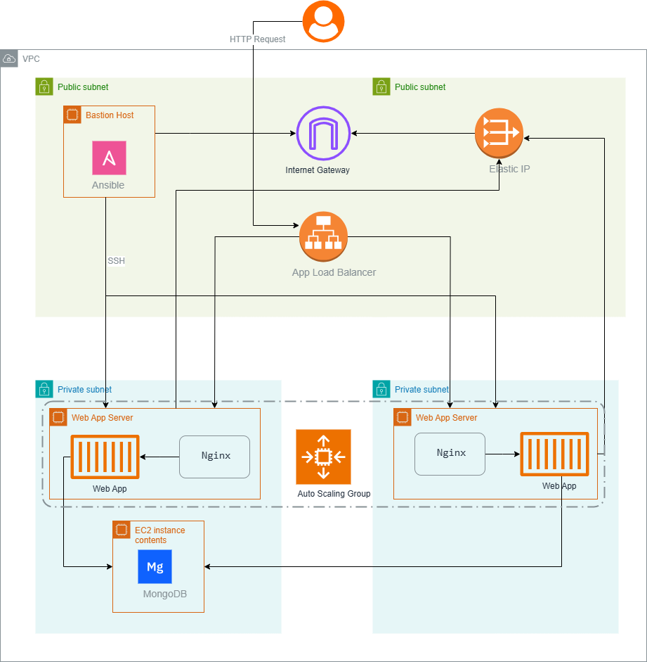

### Project Overview

This project is a cloud infrastructure solution designed to host a web application and its associated backend services in a secure and scalable environment on AWS. The architecture includes the following components:

1. **VPC**: A Virtual Private Cloud (VPC) is created with a CIDR block of `10.0.0.0/16`. This VPC serves as the primary network environment for all resources.
2. **Subnets**: Four subnets are created:
   - Two public subnets for the bastion host and the Application Load Balancer.
   - Two private subnets for the web/app servers and the MongoDB database.
3. **Bastion Host**: An EC2 instance in the public subnet to securely access resources in the private subnets via SSH.
4. **MongoDB Database**: A private EC2 instance in one of the private subnets for database storage.
5. **Web/App Servers**: Two EC2 instances in private subnets deployed as part of an Auto Scaling Group for high availability and scalability. These servers run a containerized application managed by Docker Compose and are fronted by an NGINX reverse proxy.
6. **Application Load Balancer (ALB)**: The ALB distributes incoming HTTP requests to the web/app servers in the Auto Scaling Group.
7. **NAT Gateway**: Allows private subnets to access the internet for updates or downloads without exposing them directly.
8. **Security Groups**: Configured to control access to and between resources:
   - ALB Security Group allows HTTP access from the internet.
   - EC2 Security Group allows traffic from the ALB and SSH access for administration.
   - MongoDB Security Group restricts database access to the web/app servers.

### Architecture Description
### Diagram

#### Public Subnets
- **Bastion Host**: Serves as a jump server for accessing private instances. This enhances security by preventing direct SSH access to private instances.
- **Application Load Balancer (ALB)**: Handles incoming HTTP requests and forwards them to the target group comprising the web/app servers.

#### Private Subnets
- **Web/App Servers**: Auto-scaled instances running a Dockerized application with two replicas for fault tolerance. NGINX serves as a reverse proxy, routing requests to the application.
- **MongoDB**: A standalone instance used as the backend database, accessible only from the private subnets.

#### Networking
- **Internet Gateway**: Provides internet access to the public subnets.
- **NAT Gateway**: Allows instances in the private subnets to initiate outbound internet connections while remaining unreachable from the internet.
- **Route Tables**: Separate route tables are configured for public and private subnets to define their connectivity.

### Deployment Steps
1. **Infrastructure Provisioning with Terraform**:
   - Use Terraform to create the VPC, subnets, security groups, EC2 instances, Application Load Balancer, and Auto Scaling Group.
   - Define variables to make the deployment configurable (e.g., AMI ID, instance types, subnet CIDRs).

2. **Application Deployment with Ansible**:
   - Prepare the web/app servers by installing Docker and Docker Compose.
   - Use Ansible to deploy the containerized application behind NGINX, ensuring at least two replicas for redundancy.
   - Configure NGINX to route incoming requests to the application containers.

3. **Security Configuration**:
   - Apply strict security group rules to minimize the attack surface.
   - Use the bastion host for secure SSH access to private resources.

### Key Features
- **High Availability**: The Auto Scaling Group ensures that at least two web/app servers are always running.
- **Scalability**: The architecture can scale horizontally by increasing the desired capacity of the Auto Scaling Group.
- **Security**: Public-facing components (bastion host, ALB) are isolated from private resources (web/app servers, MongoDB).

